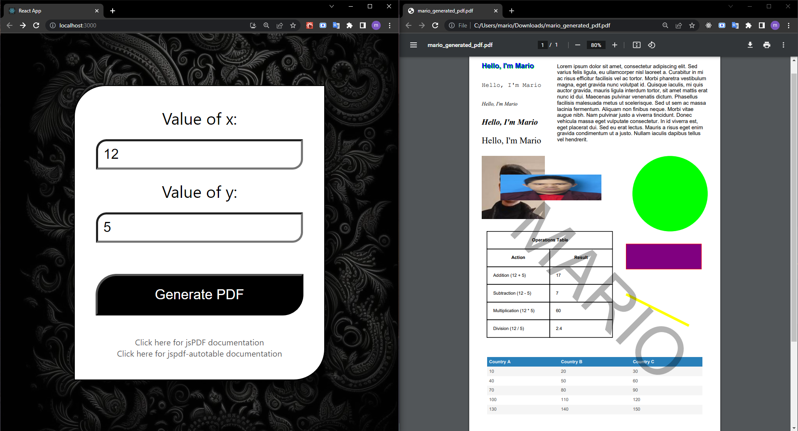
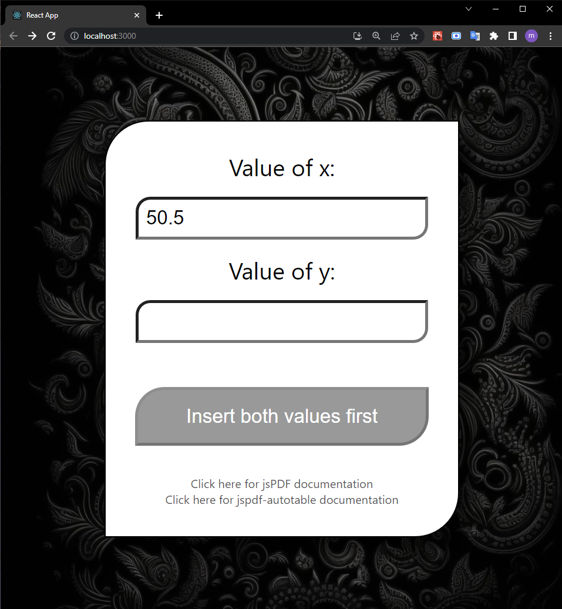

# PDF Generation

A project where I use the jsPDF library to generate a pdf file, whose contents can be manipulated by the user's inputs.

Project made by Mario (with some of my own code modifications).

---

Some screenshots:

---

The tutorial video can be found [here](https://www.youtube.com/watch?v=aVb8YjtH9rM).

---

Other Important Resources:

Click [here](https://artskydj.github.io/jsPDF/docs/index.html) for jsPDF documentation

Click [here](https://www.npmjs.com/package/jspdf-autotable/v/3.5.14) for jspdf-autotable documentation
